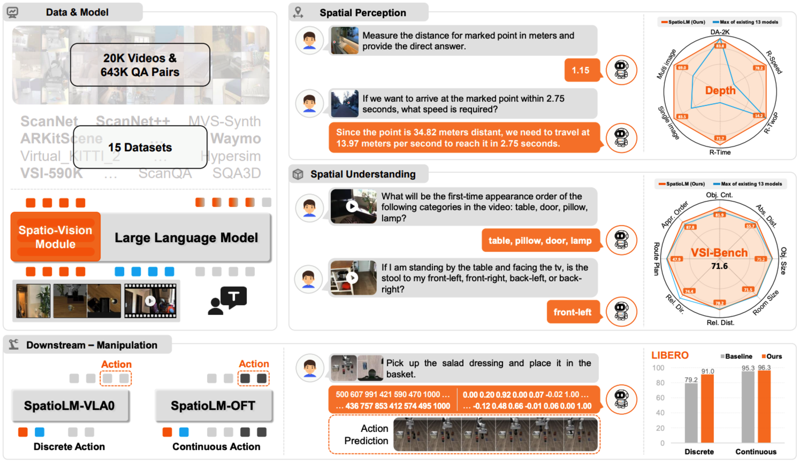
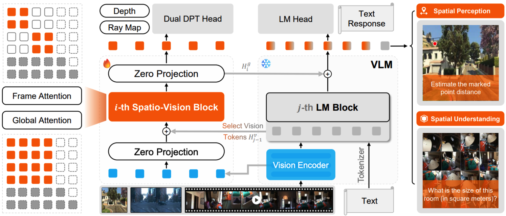

# SpatioLM: Towards General Physical Spatial Intelligence in Vision-Language Models

<p align="center">
  <a href="https://openreview.net/forum?id=CHavqrN1X9"></a>
  <a href="https://arxiv.org/abs/2608.01899"></a>
  <a href="https://icml.cc/virtual/2026/poster/65576"></a>
  <a href="https://huggingface.co/collections/xiaomi-research/spatiolm"></a>
  <a href="https://xiaomi-research.github.io/spatio-lm/"></a>
</p>

> <a href="README.md"></a> <a href="README.zh.md"></a> Official implementation of **SpatioLM**, accepted as an **Oral presentation at the Forty-third International Conference on Machine Learning (ICML 2026)**.

SpatioLM is a parameter-efficient framework for improving spatial intelligence in vision-language models (VLMs). It introduces a plug-and-play spatio-vision module and uses pseudo depth and camera supervision to learn physically coherent representations, without requiring 3D inputs at inference time. The same framework supports spatial perception, spatial reasoning, and embodied manipulation tasks.



## ✨ Highlights

- **Non-invasive spatial enhancement:** preserves the general-purpose capabilities of the underlying VLM while improving spatial reasoning.
- **3D-aware supervision:** distills token, depth, and camera-ray knowledge from a Depth Anything 3 teacher during training.
- **Image and video support:** handles single images, multiple images, and sampled video frames.
- **Strong spatial reasoning:** achieves 71.6 on VSI-Bench, the first reported result above 70 on this benchmark.
- **Unified training stack:** extends [MS-SWIFT](https://github.com/modelscope/ms-swift) with a dedicated `spatiolm sft3d` entry point.
- **Unified evaluation stack:** extends [LMMs-Eval](https://github.com/EvolvingLMMs-Lab/lmms-eval) with spatial benchmarks and OpenAI-compatible API evaluation.



## 📦 Release Status

This repository contains the model implementation, the 3D distillation trainer, data loaders, and evaluation tasks. Official checkpoints are available in the [SpatioLM collection on Hugging Face](https://huggingface.co/collections/xiaomi-research/spatiolm). Benchmark datasets are not stored in Git; prepare them separately and pass their local paths through the commands below.

## 🤗 Model Zoo

The released checkpoints cover three complementary capabilities: **Understanding** for spatial reasoning and scene understanding, **Perception** for metric depth and physical spatial perception, and **Action** for embodied manipulation with discrete VLA actions. The Understanding and Perception tracks are each available with two 8B vision-language backbones.

| Checkpoint | Capability | Backbone | Intended use |
| --- | --- | --- | --- |
| [SpatioLM-Understanding-InternVL3.5](https://huggingface.co/xiaomi-research/SpatioLM-Understanding-InternVL3.5) | Understanding | InternVL3.5 8B | Spatial reasoning and scene understanding |
| [SpatioLM-Understanding-SenseNovaSI](https://huggingface.co/xiaomi-research/SpatioLM-Understanding-SenseNovaSI) | Understanding | SenseNova-SI 1.1 / InternVL3 8B | Spatial reasoning and scene understanding |
| [SpatioLM-Perception-InternVL3.5](https://huggingface.co/xiaomi-research/SpatioLM-Perception-InternVL3.5) | Perception | InternVL3.5 8B | Metric depth and physical spatial perception |
| [SpatioLM-Perception-SenseNovaSI](https://huggingface.co/xiaomi-research/SpatioLM-Perception-SenseNovaSI) | Perception | SenseNova-SI 1.1 / InternVL3 8B | Metric depth and physical spatial perception |
| [SpatioLM-Action-VLA0](https://huggingface.co/xiaomi-research/SpatioLM-Action-VLA0) | Action | SenseNova-SI 1.1 / InternVL3 2B | Embodied manipulation with discrete VLA actions |

All checkpoints use the SpatioLM model implementation in this repository and require no additional 3D input at inference time. Use an Understanding checkpoint for general spatial question answering, a Perception checkpoint when metric geometry is central to the task, and the Action checkpoint for embodied control.

## 🛠️ Installation

<details>
<summary><strong>Requirements</strong></summary>

- Linux
- Python 3.10 recommended
- NVIDIA GPU with CUDA support
- CUDA toolkit when building FlashAttention

The code has been tested with the following stack:

| Package | Tested version |
| --- | --- |
| Python | 3.10 |
| PyTorch | 2.6.0 + CUDA 12.4 |
| torchvision | 0.21.0 |
| Transformers | 4.57.3 |
| MS-SWIFT | 3.12.1 |
| LMMs-Eval | 0.4.0 |
| Accelerate | 1.12.0 |
| DeepSpeed | 0.18.4 |
| FlashAttention | 2.7.4.post1 |

</details>

<details>
<summary><strong>Create the environment</strong></summary>

Run the following commands from the repository root. Change the PyTorch wheel index if your CUDA runtime is not compatible with CUDA 12.4.

```bash
conda create -n spatiolm python=3.10 -y
conda activate spatiolm

pip install torch==2.6.0 torchvision==0.21.0 \
  --index-url https://download.pytorch.org/whl/cu124

pip install \
  "transformers>=4.56.1,<5" \
  "accelerate>=1.10,<2" \
  "deepspeed>=0.14,<0.20" \
  "ms-swift[all]>=3.8,<4" \
  "lmms-eval>=0.4,<1" \
  "qwen-vl-utils<0.0.12" \
  decord h5py einops

pip install "flash-attn<2.8" --no-build-isolation
pip install -e .
```

FlashAttention is recommended for training but is not required for basic inference. If it cannot be built on your system, skip its installation and replace `--attn_impl flash_attention_2` with `--attn_impl sdpa` in the training commands.

Verify the installation:

```bash
spatiolm sft3d --help
slm_eval --help
```

</details>

## 🗂️ Model and Data Preparation

A typical local layout is:

```text
data/
├── ckpts/
│   ├── spatiolm-init-or-checkpoint/
│   └── DA3-Large/
├── train/
│   └── spatial_train.jsonl
├── train-v3r/                  # Optional raw DepthLM data
│   └── scannet/
└── eval/
    ├── DA-2K/
    ├── site_bench/
    └── spatiolm_depth/
work_dirs/
```

`MODEL_PATH` must point to a SpatioLM-compatible InternVL checkpoint. For 3D distillation, its configuration must contain the SpatioLM vision condition and DPT-head configuration. `TEACHER3D_PATH` must point to a Hugging Face-compatible Depth Anything 3 teacher checkpoint loadable by `AutoModelForDepthEstimation`.

> [!NOTE]
> The SpatioLM initialization and teacher checkpoints are derived from the following public models:
>
> | Usage | Public source model |
> | --- | --- |
> | InternVL3.5 initialization | [`OpenGVLab/InternVL3_5-8B`](https://huggingface.co/OpenGVLab/InternVL3_5-8B) |
> | SenseNova-SI initialization | [`sensenova/SenseNova-SI-1.1-InternVL3-8B`](https://huggingface.co/sensenova/SenseNova-SI-1.1-InternVL3-8B) |
> | VLA0 initialization | [`sensenova/SenseNova-SI-1.1-InternVL3-8B`](https://huggingface.co/sensenova/SenseNova-SI-1.1-InternVL3-8B) |
> | Depth teacher source | [`depth-anything/DA3-LARGE`](https://huggingface.co/depth-anything/DA3-LARGE) |
>
> The first three entries identify the upstream VLM weights used to build the corresponding initialization checkpoints; they are not drop-in replacements for `MODEL_PATH`. Before running `spatiolm sft3d`, prepare a SpatioLM-compatible checkpoint whose `config.json` includes the required `vision_condition_config` and `vision_dpt_config` fields. Similarly, the public DA3 repository uses the official Depth Anything 3 checkpoint layout, while `TEACHER3D_PATH` currently expects the project-converted Hugging Face layout registered as `DA3Model` and loadable through `AutoModelForDepthEstimation`.

<details>
<summary><strong>Supervised JSONL format</strong></summary>

Training data follows the MS-SWIFT multimodal JSONL format. Each line contains a conversation and either `images` or `videos`:

```json
{"messages":[{"role":"user","content":"<image>Which marked point is closer to the camera?"},{"role":"assistant","content":"A"}],"images":["/path/to/image.jpg"]}
```

```json
{"messages":[{"role":"user","content":"<video>Describe the spatial relationship between the objects."},{"role":"assistant","content":"The chair is to the left of the table."}],"videos":["/path/to/video.mp4"]}
```

Media paths may be absolute or relative to the directory from which training is launched. The number of `<image>` or `<video>` placeholders must match the supplied media.

For preparing VSI-590K-style annotations, use [`scripts/data/README.md`](scripts/data/README.md). The included converter defaults relative media paths to the `--input` directory, validates every record, and writes a training-ready JSONL file without requiring private dataset paths.

```bash
python scripts/data/prepare_vlm_data.py \
  --input data/raw/VSI-590K \
  --output data/train-vlm/vlm-3d/VSI-590K
```

The same guide also documents downloading the public VSI-590K annotations and media archives, including selective downloads and HTTP proxy configuration.

<details>
<summary><strong>Download VSI-590K</strong></summary>

Install the Hugging Face Hub CLI:

```bash
pip install -U huggingface_hub
```

Download the annotation file only:

```bash
hf download nyu-visionx/VSI-590K \
  --repo-type dataset \
  --include vsi_590k.jsonl \
  --local-dir data/raw/VSI-590K
```

Download the annotation file and all media archives:

```bash
hf download nyu-visionx/VSI-590K \
  --repo-type dataset \
  --include vsi_590k.jsonl \
  --include '*.tar.gz' \
  --local-dir data/raw/VSI-590K
```

Download only selected source archives:

```bash
hf download nyu-visionx/VSI-590K \
  --repo-type dataset \
  --include vsi_590k.jsonl \
  --include scannet.tar.gz \
  --include scannetppv2.tar.gz \
  --local-dir data/raw/VSI-590K
```

If direct access is unavailable, configure a proxy before downloading:

```bash
export HTTP_PROXY=http://127.0.0.1:7890
export HTTPS_PROXY=http://127.0.0.1:7890
export ALL_PROXY=http://127.0.0.1:7890
```

Then run any `hf download` command above. Extract downloaded archives under
the same dataset root:

```bash
find data/raw/VSI-590K -maxdepth 1 -name '*.tar.gz' -print0 \
  | xargs -0 -n1 tar -xzf - -C data/raw/VSI-590K
```

</details>

</details>

<details>
<summary><strong>Optional DepthLM raw data</strong></summary>

The built-in DepthLM dataset generates spatial questions from RGB videos, metric depth, camera intrinsics, and camera poses. Each video must have a sidecar HDF5 file with the same stem:

```text
data/train-v3r/scannet/
├── scene0000_00.mp4
└── scene0000_00.h5
```

The HDF5 file must contain:

| Key | Shape | Description |
| --- | --- | --- |
| `depth` | `(T, H, W)` | Metric depth maps; the dataset also reads its `invalid` attribute |
| `intrinsic` | `(T, 3, 3)` | Camera intrinsic matrices |
| `pos` | `(T, 4, 4)` | Camera-to-world poses |

The registered dataset identifier remains `cvlm3d/depthlm` for backward compatibility. For example:

```bash
DEPTH_DATASET='torch::cvlm3d/depthlm::data_root="data/train-v3r",video_folders=["scannet"]'
```

Append `#N` to the identifier to sample or repeat it to `N` examples, for example `torch::cvlm3d/depthlm#1000::...`.

</details>

## 🚀 Training

<details>
<summary><strong>3D-supervised training</strong></summary>

The main training entry point combines language-model loss with token, depth, and camera-ray distillation losses.

```bash
export MODEL_PATH=/path/to/spatiolm-init
export TEACHER3D_PATH=/path/to/DA3-Large
export TRAIN_JSONL=/path/to/spatial_train.jsonl
export OUTPUT_DIR=work_dirs/spatiolm-sft3d

export VIDEO_SEGMENTS=12
export LOSS_LM_WEIGHT=0.6
export LOSS_TOKEN_WEIGHT=0.2
export LOSS_DEPTH_WEIGHT=0.1
export LOSS_RAY_WEIGHT=0.1
export DPT_LR_SCALE=10.0

NPROC_PER_NODE=8 spatiolm sft3d \
  --model "$MODEL_PATH" \
  --teacher3d "$TEACHER3D_PATH" \
  --use_hf true \
  --train_type full \
  --freeze_parameters_ratio 1 \
  --trainable_parameters_regex "^(language_model.*(vision_3r.*|dpt_head)|condition_proj)" \
  --torch_dtype bfloat16 \
  --dataset "$TRAIN_JSONL" \
  --num_train_epochs 1 \
  --per_device_train_batch_size 2 \
  --gradient_accumulation_steps 2 \
  --learning_rate 2e-5 \
  --warmup_ratio 0.05 \
  --logging_steps 5 \
  --save_strategy epoch \
  --save_total_limit 2 \
  --save_only_model true \
  --remove_unused_columns false \
  --ddp_find_unused_parameters false \
  --split_dataset_ratio 0 \
  --deepspeed zero2 \
  --attn_impl flash_attention_2 \
  --output_dir "$OUTPUT_DIR"
```

Set `NPROC_PER_NODE=1` for single-GPU training. For multi-node jobs, also set the standard `NNODES`, `NODE_RANK`, `MASTER_ADDR`, and `MASTER_PORT` variables understood by MS-SWIFT.

To combine regular JSONL data with the generated DepthLM dataset, replace the `--dataset` line in the command above with:

```bash
--dataset "$TRAIN_JSONL" "$DEPTH_DATASET"
```

</details>

<details>
<summary><strong>Standard supervised fine-tuning</strong></summary>

Use MS-SWIFT directly when 3D teacher distillation is not required. The custom registration file enables the SpatioLM model and template definitions.

```bash
swift sft \
  --custom_register_path src/spatiolm/swift/register.py \
  --model "$MODEL_PATH" \
  --use_hf true \
  --train_type full \
  --freeze_parameters_ratio 1 \
  --trainable_parameters_regex "^(language_model.*vision_3r.*|condition_proj)" \
  --torch_dtype bfloat16 \
  --dataset "$TRAIN_JSONL" \
  --num_train_epochs 1 \
  --per_device_train_batch_size 2 \
  --gradient_accumulation_steps 2 \
  --learning_rate 2e-5 \
  --warmup_ratio 0.05 \
  --logging_steps 5 \
  --save_strategy epoch \
  --save_only_model true \
  --split_dataset_ratio 0 \
  --attn_impl flash_attention_2 \
  --output_dir work_dirs/spatiolm-sft
```

The effective global batch size is `per_device_train_batch_size × gradient_accumulation_steps × number_of_GPUs × number_of_nodes`.

</details>

## 🔍 Inference

The Understanding and Perception checkpoints share the same image-inference interface. Set `checkpoint` to a Hugging Face model ID from the table above or to a downloaded local path:

<details>
<summary><strong>Image inference example</strong></summary>

```python
import torch
from lmms_eval.models.simple.internvl2 import load_image
from PIL import Image
from transformers import AutoTokenizer

from spatiolm.models import InternVL3RChatModel

checkpoint = "xiaomi-research/SpatioLM-Understanding-InternVL3.5"
image_path = "/path/to/image.jpg"

model = InternVL3RChatModel.from_pretrained(
    checkpoint,
    dtype=torch.bfloat16,
    low_cpu_mem_usage=True,
).eval().cuda()
tokenizer = AutoTokenizer.from_pretrained(
    checkpoint,
    trust_remote_code=True,
    use_fast=False,
)

image = Image.open(image_path).convert("RGB")
pixel_values = load_image(image, input_size=448).to(
    device="cuda",
    dtype=torch.bfloat16,
)
answer = model.chat(
    tokenizer,
    pixel_values,
    "Which object is closer to the camera?",
    {"max_new_tokens": 128, "do_sample": False},
)
print(answer)
```

</details>

For video inference and batched benchmark execution, use the `slm_eval` interface below. Set `VIDEO_SEGMENTS` to control the number of sampled frames.

## 📊 Evaluation

`slm_eval` preserves the LMMs-Eval CLI and automatically registers the additional SpatioLM models and tasks.

Download the SpatioLM depth benchmark in its `load_from_disk` layout:

```bash
hf download edatai/spatiolm-depth \
  --repo-type dataset \
  --local-dir data/eval/spatiolm_depth
```

See [`src/slm_eval/README.md`](src/slm_eval/README.md) for the depth benchmark splits, metrics, and evaluation commands.

<details>
<summary><strong>Evaluate a local checkpoint</strong></summary>

```bash
export CHECKPOINT=/path/to/spatiolm-checkpoint
export VIDEO_SEGMENTS=48

slm_eval \
  --model spatiolm \
  --model_args "pretrained=${CHECKPOINT},modality=video" \
  --tasks site_bench_video \
  --batch_size 1 \
  --log_samples \
  --output_path work_dirs/eval/site_bench_video
```

For multi-GPU evaluation:

```bash
accelerate launch --multi_gpu --num_processes 8 -m slm_eval \
  --model spatiolm \
  --model_args "pretrained=${CHECKPOINT},modality=video" \
  --tasks site_bench_video \
  --batch_size 1 \
  --log_samples \
  --output_path work_dirs/eval/site_bench_video
```

</details>

<details>
<summary><strong>Evaluate an OpenAI-compatible API</strong></summary>

Any endpoint implementing the OpenAI Chat Completions interface can be evaluated with the parallel API adapter:

```bash
export OPENAI_API_BASE=https://your-endpoint.example.com/v1
export OPENAI_API_KEY=your-api-key

slm_eval \
  --model parallel_openai_compatible \
  --model_args "model_version=your-model-name,max_workers=16,max_num_frames=16" \
  --tasks cvbench \
  --batch_size 1 \
  --log_samples \
  --output_path work_dirs/eval/api
```

For Azure OpenAI, set `azure_openai=true` in `--model_args` and export `AZURE_OPENAI_API_KEY`, `AZURE_OPENAI_API_BASE`, and `AZURE_OPENAI_API_VERSION`.

</details>

### Included spatial tasks

The repository adds the following task configurations on top of the standard LMMs-Eval catalog:

| Data source | Tasks |
| --- | --- |
| Hugging Face datasets | `blink`, `cvbench`, `embspatialbench` |
| Local benchmark data | `da2k`, `mindcube_tiny`, `my_mmsi_bench`, `scanqa`, `site_bench_image`, `site_bench_video`, `sqa3d`, `viewspatialbench`, `myvsibench` |
| SpatioLM depth benchmark | `spatiolm_depth_sv`, `spatiolm_depth_mv`, `spatiolm_depth_mt` |

List all registered tasks with:

```bash
slm_eval --tasks list
```

Tasks backed by local data read their paths from `src/slm_eval/tasks/*/*.yaml`. Place each processed Hugging Face dataset at the configured `dataset_path`, or update that field to your local path before evaluation.

## 🧱 Repository Structure

```text
src/spatiolm/
├── cli/          # MS-SWIFT-compatible training entry points
├── datasets/     # RGB, depth, camera, and generated spatial QA datasets
├── losses/       # Token, depth, and ray distillation losses
├── models/       # SpatioLM, Depth Anything 3, InternVL, and VGGT components
├── swift/        # Model/template registration and 3D trainer
└── templates/    # InternVL and Qwen-VL multimodal templates
src/slm_eval/
├── simple/       # Local-checkpoint and OpenAI-compatible model adapters
└── tasks/        # Spatial benchmark definitions and metrics
```

## 🔧 Troubleshooting

- **CUDA out of memory:** reduce `VIDEO_SEGMENTS` or `per_device_train_batch_size`, then increase `gradient_accumulation_steps` to preserve the global batch size.
- **FlashAttention build or import failure:** omit FlashAttention and use `--attn_impl sdpa`.
- **Dataset not found:** check the task YAML under `src/slm_eval/tasks` and ensure `dataset_path` points to a dataset saved with Hugging Face `save_to_disk` when `load_from_disk: true` is set.
- **Checkpoint configuration error:** verify that the checkpoint is a SpatioLM-compatible InternVL model and that its `config.json` contains the vision condition and DPT-head configuration required by the selected training mode.

## 🙏 Acknowledgements

This work is built upon and inspired by several outstanding open-source projects, including [MS-SWIFT](https://github.com/modelscope/ms-swift), [Depth Anything 3](https://github.com/ByteDance-Seed/Depth-Anything-3), [SenseNova-SI](https://github.com/OpenSenseNova/SenseNova-SI), [InternVL](https://github.com/OpenGVLab/InternVL), [VGGT](https://github.com/facebookresearch/vggt), and [LMMs-Eval](https://github.com/EvolvingLMMs-Lab/lmms-eval). We sincerely thank their authors and contributors for sharing their work with the community.

## 📝 Citation

If you find this work useful, please cite:

```bibtex
@inproceedings{wu2026spatiolm,
  title={SpatioLM: Towards General Physical Spatial Intelligence in Vision-Language Models},
  author={Wu, Jing and Wu, Jianhua and Guan, Jiayi and Chen, Jiahong and Lu, Jinghui and Ye, Hangjun and Gao, Bingzhao and Chen, Long},
  booktitle={International Conference on Machine Learning (ICML)},
  year={2026},
  note={To appear},
  eprint={2608.01899},
  archivePrefix={arXiv},
  url={https://arxiv.org/abs/2608.01899}
}
```
